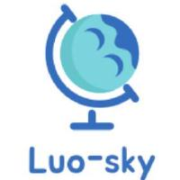
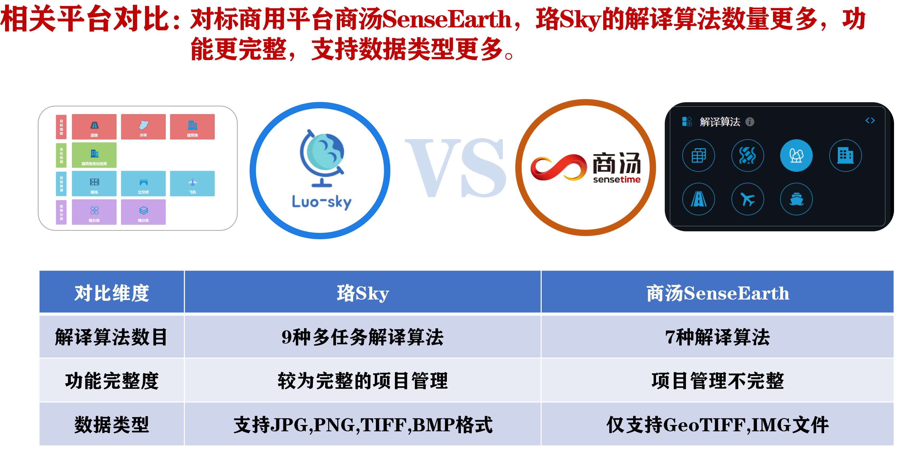
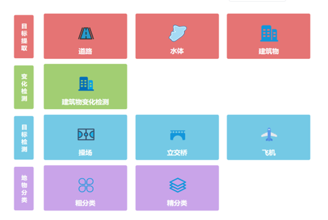

# 0简介

# L-Sky(珞Sky)

L-Sky 是一个基于百度飞浆PaddlePaddle开发的遥感智能解译平台，具有六大特色亮点：

- 多任务解译
- 高精度处理
- 多类型数据
- 自定义空间
- 高友好交互

## 多任务解译

### **4种类型——9种算法**

- 目标提取
    - 道路提取
    - 水体提取
    - 建筑物提取
- 目标检测
    - 操场检测
    - 立交桥检测
    - 飞机检测
- 变化检测
    - 建筑物变化检测
- 地物分类
    - 粗分类
    - 精分类

## 为 L-Sky 做出贡献

感谢你对 L-Sky 的贡献，参与贡献的方式有很多，我们感谢所有的贡献💖。

### 反馈🐛

如果你对 L-Sky 目前现状有任何疑惑或者建议欢迎用 ISSUE 的方式进行反馈。

并不需要担心提出的问题没有价值，我们鼓励所有类型的沟通，发现问题也是对社区进行贡献的一种方式❤️。

### 参与讨论💬

我们开放了讨论渠道，如果你有任何想讨论的问题，欢迎与我们交流。
